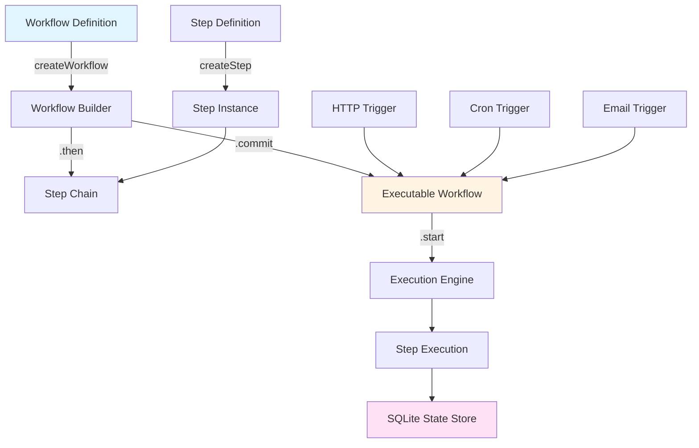

# Val Town Workflow Engine - Implementation Plan

## Project Overview

Build a **TypeScript-first workflow engine** for Val Town inspired by Mastra's architecture, optimized for learning and personal automation use cases.

---

## Design Principles

1. **Strong Typing**: Full TypeScript inference across workflow definitions
2. **Composable**: Steps and workflows are composable units
3. **Flexible Triggering**: Workflows as modules callable from any Val Town trigger (HTTP, Cron, Email)
4. **Simple State Management**: SQLite-backed with ACID guarantees
5. **Val Town Native**: Embrace platform constraints (no external dependencies)

---

## Architecture Overview



---

## Phase 1: Core Engine (MVP)

### Components to Build

#### 1. **Step Definition** (`step.ts`)

```typescript
interface StepConfig<TId, TInput, TOutput, TState> {
  id: TId;
  description?: string;
  inputSchema: z.ZodSchema<TInput>;
  outputSchema: z.ZodSchema<TOutput>;
  stateSchema?: z.ZodSchema<TState>;
  execute: ExecuteFunction<TInput, TOutput, TState>;
}

interface ExecuteFunction<TInput, TOutput, TState> {
  (context: {
    inputData: TInput;
    state?: TState;
    setState?: (state: TState) => void;
    getStepResult: <T extends Step>(step: T) => z.infer<T['outputSchema']>;
    getInitData: () => any;
  }): Promise<TOutput> | TOutput;
}

function createStep<TId, TInput, TOutput, TState>(
  config: StepConfig<TId, TInput, TOutput, TState>
): Step<TId, TInput, TOutput, TState>;
```

**Example Usage:**
```typescript
const fetchUser = createStep({
  id: 'fetch-user',
  inputSchema: z.object({ userId: z.string() }),
  outputSchema: z.object({ 
    name: z.string(), 
    email: z.string() 
  }),
  execute: async ({ inputData }) => {
    const user = await db.getUser(inputData.userId);
    return { name: user.name, email: user.email };
  }
});
```

---

#### 2. **Workflow Builder** (`workflow.ts`)

```typescript
interface WorkflowConfig<TId, TInput, TOutput> {
  id: TId;
  description?: string;
  inputSchema: z.ZodSchema<TInput>;
  outputSchema: z.ZodSchema<TOutput>;
  stateSchema?: z.ZodSchema<any>;
}

class WorkflowBuilder<TSteps, TInput, TPrevOutput> {
  then<TStep extends Step>(
    step: TStep
  ): WorkflowBuilder<TSteps & Record<TStep['id'], TStep>, TInput, TStep['outputSchema']>;
  
  commit(): Workflow<TSteps, TInput, TPrevOutput>;
}

function createWorkflow<TId, TInput, TOutput>(
  config: WorkflowConfig<TId, TInput, TOutput>
): WorkflowBuilder<{}, TInput, TInput>;
```

**Example Usage:**
```typescript
const emailWorkflow = createWorkflow({
  id: 'email-campaign',
  inputSchema: z.object({ userId: z.string() }),
  outputSchema: z.object({ sent: z.boolean() })
})
  .then(fetchUser)
  .then(generateEmail)
  .then(sendEmail)
  .commit();

// Fully typed!
type Output = z.infer<typeof emailWorkflow.outputSchema>;
```

---

#### 3. **Execution Engine** (`engine.ts`)

```typescript
interface ExecutionContext {
  workflowId: string;
  runId: string;
  executionPath: number[];  // Current position in step array
  stepResults: Record<string, StepResult>;
  state: Record<string, any>;
}

interface StepResult<T = any> {
  status: 'success' | 'failed' | 'running';
  output?: T;
  error?: Error;
  timestamp: number;
}

class ExecutionEngine {
  async execute<TInput, TOutput>(params: {
    workflow: Workflow;
    runId: string;
    inputData: TInput;
    initialState?: any;
  }): Promise<TOutput> {
    // 1. Initialize execution context
    // 2. Iterate through steps sequentially
    // 3. Execute each step with context
    // 4. Persist state after each step
    // 5. Return final output
  }
  
  private async executeStep(
    step: Step,
    context: ExecutionContext,
    inputData: any
  ): Promise<StepResult>;
}
```

---

#### 4. **State Persistence** (`storage.ts`)

```typescript
interface WorkflowSnapshot {
  runId: string;
  workflowId: string;
  status: 'running' | 'success' | 'failed';
  executionPath: number[];
  stepResults: Record<string, StepResult>;
  state: Record<string, any>;
  result?: any;
  error?: string;
  timestamp: number;
}

class WorkflowStorage {
  constructor(private sqlite: typeof import('@std/sqlite'));

  async init(): Promise<void> {
    await this.sqlite.execute(`
      CREATE TABLE IF NOT EXISTS wrkflw_workflow_runs (
        run_id TEXT PRIMARY KEY,
        workflow_id TEXT NOT NULL,
        status TEXT NOT NULL,
        execution_path TEXT,
        step_results TEXT,
        state TEXT,
        result TEXT,
        error TEXT,
        created_at INTEGER DEFAULT (unixepoch()),
        updated_at INTEGER DEFAULT (unixepoch())
      )
    `);
  }
  
  async saveSnapshot(snapshot: WorkflowSnapshot): Promise<void>;
  async loadSnapshot(runId: string): Promise<WorkflowSnapshot | null>;
  async listRuns(workflowId?: string): Promise<WorkflowSnapshot[]>;
}
```

---

#### 5. **Run Management** (`run.ts`)

```typescript
class WorkflowRun<TInput, TOutput> {
  constructor(
    private workflow: Workflow,
    private runId: string,
    private engine: ExecutionEngine,
    private storage: WorkflowStorage
  ) {}
  
  async start(params: {
    inputData: TInput;
    initialState?: any;
  }): Promise<TOutput> {
    return this.engine.execute({
      workflow: this.workflow,
      runId: this.runId,
      inputData: params.inputData,
      initialState: params.initialState
    });
  }
}

// On Workflow class
class Workflow<TSteps, TInput, TOutput> {
  async createRun(runId?: string): Promise<WorkflowRun<TInput, TOutput>> {
    const id = runId || crypto.randomUUID();
    return new WorkflowRun(this, id, this.engine, this.storage);
  }
}
```

---

### Directory Structure

```
wrkflw/
├── backend/
│   ├── index.ts           # Main entry point / exports
│   ├── step.ts            # Step definition & creation
│   ├── workflow.ts        # Workflow builder & class
│   ├── engine.ts          # Execution engine
│   ├── storage.ts         # SQLite persistence
│   ├── run.ts             # Run management
│   └── types.ts           # Shared TypeScript types
├── examples/
│   ├── email-workflow.ts  # Example workflow
│   ├── http-trigger.ts    # HTTP trigger example
│   └── cron-trigger.ts    # Cron trigger example
├── PLAN.md
├── README.md
└── deno.json
```

---

## Implementation Tasks

### Milestone 1: Type System & Builders

- [ ] Define core types (`Step`, `Workflow`, `ExecutionContext`, `StepResult`)
- [ ] Implement `createStep()` with Zod schema validation
- [ ] Implement `createWorkflow()` with fluent builder
- [ ] Add `.then()` method with type inference
- [ ] Add `.commit()` to finalize workflow
- [ ] Test type inference chain (compile-time checks)

### Milestone 2: Execution Engine

- [ ] Implement `ExecutionEngine` class
- [ ] Sequential step execution loop
- [ ] Build execution context with step results
- [ ] Implement `getStepResult()` helper
- [ ] Implement `getInitData()` helper
- [ ] Error handling and result wrapping

### Milestone 3: State Persistence

- [ ] Create SQLite schema for workflow runs
- [ ] Implement `WorkflowStorage` class
- [ ] Add `saveSnapshot()` after each step
- [ ] Add `loadSnapshot()` for debugging
- [ ] Add `listRuns()` for observability

### Milestone 4: Run Management

- [ ] Implement `WorkflowRun` class
- [ ] Add `createRun()` to Workflow
- [ ] Add `start()` method
- [ ] Generate/validate run IDs
- [ ] Connect engine + storage

### Milestone 5: Examples & Documentation

- [ ] Create simple email workflow example
- [ ] Create HTTP trigger val example
- [ ] Create Cron trigger val example
- [ ] Write README with usage examples
- [ ] Document type inference patterns

---

## Example End-to-End Usage

### 1. Define Workflow

```typescript
// backend/workflows/email-campaign.ts
import { createWorkflow, createStep } from "../index.ts";
import { z } from "npm:zod";
import { sqlite } from "https://esm.town/v/std/sqlite";

const fetchUser = createStep({
  id: "fetch-user",
  inputSchema: z.object({ userId: z.string() }),
  outputSchema: z.object({ name: z.string(), email: z.string() }),
  execute: async ({ inputData }) => {
    const result = await sqlite.execute({
      sql: "SELECT name, email FROM users WHERE id = ?",
      args: [inputData.userId],
    });
    return {
      name: result.rows[0][0] as string,
      email: result.rows[0][1] as string,
    };
  },
});

const generateEmail = createStep({
  id: "generate-email",
  inputSchema: z.object({ name: z.string(), email: z.string() }),
  outputSchema: z.object({ subject: z.string(), body: z.string() }),
  execute: async ({ inputData }) => {
    return {
      subject: `Hello ${inputData.name}!`,
      body: `Welcome to our service, ${inputData.name}!`,
    };
  },
});

const sendEmail = createStep({
  id: "send-email",
  inputSchema: z.object({
    email: z.string(),
    subject: z.string(),
    body: z.string(),
  }),
  outputSchema: z.object({ sent: z.boolean(), messageId: z.string() }),
  execute: async ({ inputData, getStepResult }) => {
    // Access previous step results
    const user = getStepResult(fetchUser);
    
    // Send email logic
    const result = await sendEmailAPI({
      to: user.email,
      subject: inputData.subject,
      body: inputData.body,
    });
    
    return { sent: true, messageId: result.id };
  },
});

export const emailCampaign = createWorkflow({
  id: "email-campaign",
  inputSchema: z.object({ userId: z.string() }),
  outputSchema: z.object({ sent: z.boolean(), messageId: z.string() }),
})
  .then(fetchUser)
  .then(generateEmail)
  .then(sendEmail)
  .commit();
```

### 2. HTTP Trigger

```typescript
// backend/triggers/http.ts
import { emailCampaign } from "../workflows/email-campaign.ts";

export default async function(req: Request) {
  const url = new URL(req.url);
  const userId = url.searchParams.get("userId");
  
  if (!userId) {
    return Response.json({ error: "Missing userId" }, { status: 400 });
  }
  
  // Create and start a run
  const run = await emailCampaign.createRun();
  const result = await run.start({ inputData: { userId } });
  
  return Response.json({
    success: true,
    runId: run.runId,
    result
  });
}
```

### 3. Cron Trigger

```typescript
// backend/triggers/cron.ts
import { emailCampaign } from "../workflows/email-campaign.ts";
import { sqlite } from "https://esm.town/v/std/sqlite";

export default async function(interval: Interval) {
  // Get users who signed up today
  const users = await sqlite.execute({
    sql: `SELECT user_id FROM users 
          WHERE date(created_at) = date('now')`,
  });
  
  // Run workflow for each user
  for (const row of users.rows) {
    const userId = row[0] as string;
    const run = await emailCampaign.createRun();
    
    try {
      await run.start({ inputData: { userId } });
      console.log(`Sent welcome email to ${userId}`);
    } catch (error) {
      console.error(`Failed to send to ${userId}:`, error);
    }
  }
}
```

---

## Technical Decisions

### Type Inference Strategy

Following Mastra's approach:
- Use generic type parameters on builders
- Thread `TPrevOutput` through `.then()` chain
- Each step's output becomes next step's input type
- Zod schemas provide runtime validation + type extraction

### State Management (Phase 1)

**Simplified approach for MVP:**
- SQLite for all workflow state (no blob storage)
- JSON serialization for step results
- Snapshot after each step execution
- Single database transaction per step

### Error Handling (Phase 1)

**Basic error wrapping:**
- Try/catch around step execution
- Capture error in `StepResult`
- Persist failed state to SQLite
- Throw error to caller (no retry logic yet)

### Execution Model (Phase 1)

**Synchronous execution:**
- Run executes all steps in single Val Town invocation
- No suspend/resume (Phase 2)
- No parallel execution (Phase 2)
- Sequential only with `.then()`

---

## Future Extensions (Post-MVP)

### Phase 2: Advanced Control Flow
- `.parallel([step1, step2])` - Concurrent execution
- `.branch([[condition, stepA], ...])` - Conditional branching
- `.map({ ... })` - Data transformation between steps

### Phase 3: Durability
- `.sleep(duration)` - Time-based delays via Cron
- Suspend/resume for long-running workflows
- Restart from last checkpoint

### Phase 4: Advanced Features
- `.foreach(step, { concurrency })` - Array iteration
- Nested workflows (workflows as steps)
- Retry logic and exponential backoff
- Workflow-level state (beyond step results)

### Phase 5: Observability
- Event streaming for step progress
- Run history and debugging UI
- Time-travel debugging
- Execution visualizations

---

## Success Criteria

**Phase 1 MVP is complete when:**
1. ✅ Can define strongly-typed steps with Zod schemas
2. ✅ Can chain steps with `.then()` and type inference works
3. ✅ Can execute workflows and get typed output
4. ✅ Step results are accessible via `getStepResult()`
5. ✅ Workflow state persists to SQLite after each step
6. ✅ Can trigger workflows from HTTP and Cron vals
7. ✅ Examples demonstrate personal automation use cases

---

## Open Questions

1. **Validation**: Should we validate schemas at runtime (dev mode) or trust TypeScript?
2. **Errors**: Should failed steps stop workflow or allow continuation?
3. **Logging**: Use `console.log` or build custom logger?
4. **Testing**: Add test examples or just examples?

---

## Next Steps

1. Set up project structure
2. Implement type system (`types.ts`)
3. Build `createStep()` function
4. Build `createWorkflow()` builder
5. Test type inference manually
6. Implement execution engine
7. Add SQLite storage
8. Create examples

---

**Ready to start building!** 🚀
