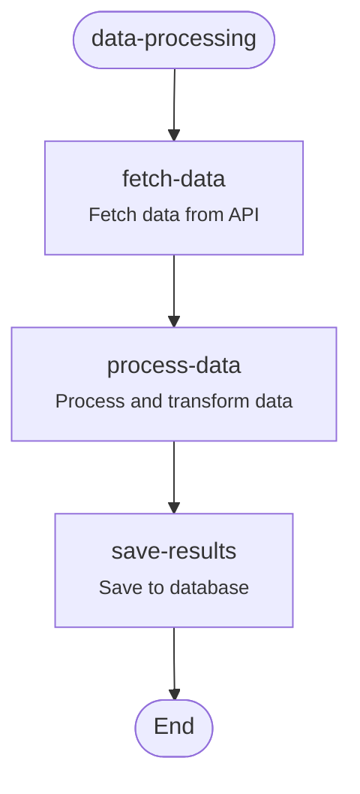

# wrkflw

A **TypeScript-first workflow engine** for Val Town, inspired by [Mastra](https://github.com/mastra-ai/mastra).

Build strongly-typed, composable workflows that run on Val Town's serverless platform.

## Features

- **Strongly Typed**: Full TypeScript inference across workflow definitions
- **Composable**: Build workflows from reusable steps
- **Trigger Agnostic**: Works with HTTP, Cron, or Email Val Town triggers
- **Durable State**: SQLite-backed persistence with ACID guarantees
- **Runtime Validation**: Zod schema validation for inputs and outputs
- **Error Handling**: Structured error tracking and recovery
- **Visual Workflows**: Generate Mermaid diagrams of workflow structure and execution state

## Quick Start

### 1. Define Steps

```typescript
import { createStep } from "./backend/index.ts";
import { z } from "npm:zod@^3.23";

const fetchUser = createStep({
  id: 'fetch-user',
  inputSchema: z.object({ userId: z.string() }),
  outputSchema: z.object({ name: z.string(), email: z.string() }),
  execute: async ({ inputData }) => {
    const user = await db.getUser(inputData.userId);
    return { name: user.name, email: user.email };
  },
});
```

### 2. Build Workflows

```typescript
import { createWorkflow } from "./backend/index.ts";

const emailWorkflow = createWorkflow({
  id: 'email-campaign',
  inputSchema: z.object({ userId: z.string() }),
  outputSchema: z.object({ sent: z.boolean() }),
})
  .then(fetchUser)       // Type: { userId: string } -> { name, email }
  .then(generateEmail)   // Type: { name, email } -> { subject, body }
  .then(sendEmail)       // Type: { subject, body } -> { sent }
  .commit();
```

### 3. Execute Workflows

```typescript
// Create a run
const run = await emailWorkflow.createRun();

// Execute
const result = await run.start({
  inputData: { userId: 'user-123' },
});

console.log(result); // { sent: true }
```

## Prebuilt Steps

wrkflw includes a collection of ready-to-use steps for common tasks:

### HTTP/API Steps

**`httpGet`** - Make GET requests to APIs
```typescript
import { httpGet, createWorkflow } from "./backend/index.ts";

const workflow = createWorkflow({
  id: 'fetch-api-data',
  inputSchema: z.object({
    url: z.string().url(),
    headers: z.record(z.string()).optional(),
    queryParams: z.record(z.string()).optional(),
  }),
  outputSchema: z.object({
    status: z.number(),
    data: z.unknown(),
    headers: z.record(z.string()),
  }),
})
  .then(httpGet)
  .commit();
```

**`httpPost`** - POST JSON data to APIs
```typescript
import { httpPost } from "./backend/index.ts";

// Use in workflow with inputData: { url, body, headers? }
```

### String/Template Steps

**`template`** - String interpolation with variables
```typescript
import { template } from "./backend/index.ts";

const workflow = createWorkflow({
  inputSchema: z.object({
    template: z.string(),
    variables: z.record(z.union([z.string(), z.number(), z.boolean()])),
  }),
  outputSchema: z.object({ result: z.string() }),
})
  .then(template)
  .commit();

// Input: { template: "Hello {{name}}!", variables: { name: "Alice" } }
// Output: { result: "Hello Alice!" }
```

### Data Transformation Steps

**`filterArray`** - Filter array items by condition
```typescript
import { filterArray } from "./backend/index.ts";

// Input: {
//   array: [1, 2, 3, 4, 5],
//   filterFn: "(n) => n % 2 === 0"
// }
// Output: {
//   filtered: [2, 4],
//   originalCount: 5,
//   filteredCount: 2
// }
```

**`mapArray`** - Transform array items
```typescript
import { mapArray } from "./backend/index.ts";

// Input: {
//   array: [1, 2, 3],
//   mapFn: "(n) => n * 2"
// }
// Output: { mapped: [2, 4, 6], count: 3 }
```

**`pickFields`** - Extract specific fields from objects
```typescript
import { pickFields } from "./backend/index.ts";

// Input: {
//   object: { id: 1, name: "Alice", secret: "xyz" },
//   fields: ["id", "name"]
// }
// Output: { result: { id: 1, name: "Alice" } }
```

### Utility Steps

**`delay`** - Wait for a specified duration
```typescript
import { delay } from "./backend/index.ts";

// Input: { durationMs: 2000 }
// Waits 2 seconds, then outputs: { durationMs: 2000, completedAt: "..." }
```

**`logger`** - Structured logging at different levels
```typescript
import { logger } from "./backend/index.ts";

// Input: {
//   level: "info",
//   message: "Processing data",
//   data: { count: 10 }
// }
// Logs to console and passes data through
```

### Complete Example with Prebuilt Steps

```typescript
import {
  createWorkflow,
  createStep,
  httpGet,
  filterArray,
  mapArray,
  template
} from "./backend/index.ts";

// Helper step to prepare API request
const prepareRequest = createStep({
  id: "prepare-request",
  inputSchema: z.object({ userId: z.number() }),
  outputSchema: z.object({
    url: z.string(),
    queryParams: z.record(z.string()).optional(),
  }),
  execute: async ({ inputData }) => ({
    url: "https://api.example.com/posts",
    queryParams: { userId: String(inputData.userId) },
  }),
});

// Build workflow using prebuilt steps
const workflow = createWorkflow({
  id: 'process-user-posts',
  inputSchema: z.object({ userId: z.number() }),
  outputSchema: z.object({ titles: z.array(z.string()) }),
})
  .then(prepareRequest)  // Convert input to API request
  .then(httpGet)         // Fetch from API (prebuilt)
  // Add more steps as needed
  .commit();
```

See `examples/prebuilt-steps-simple.ts` for more examples.

## Installation

### For Val Town

1. Create a new val or project in Val Town
2. Copy the `backend/` directory into your val
3. Import and use:

```typescript
import { createStep, createWorkflow } from "./backend/index.ts";
```

### For Local Development

```bash
git clone <your-repo>
cd wrkflw
deno run --allow-all examples/simple-workflow.ts
```

## Examples

### HTTP Trigger

Create a new HTTP val in Val Town:

```typescript
import { emailWorkflow } from "./workflows/email-campaign.ts";

export default async function(req: Request) {
  const url = new URL(req.url);
  const userId = url.searchParams.get("userId");
  
  if (!userId) {
    return Response.json({ error: "Missing userId" }, { status: 400 });
  }
  
  const run = await emailWorkflow.createRun();
  const result = await run.start({ inputData: { userId } });
  
  return Response.json({ success: true, result });
}
```

### Cron Trigger

Create a new Cron val in Val Town:

```typescript
import { welcomeWorkflow } from "./workflows/welcome.ts";

export default async function(interval: Interval) {
  // Get users who signed up in the last hour
  const newUsers = await getRecentUsers();
  
  for (const user of newUsers) {
    const run = await welcomeWorkflow.createRun();
    await run.start({ inputData: { userId: user.id } });
    console.log(`Sent welcome email to ${user.id}`);
  }
}
```

### Email Trigger

Create a new Email val in Val Town:

```typescript
import { supportWorkflow } from "./workflows/support.ts";

export default async function(email: Email) {
  const run = await supportWorkflow.createRun();
  
  const result = await run.start({
    inputData: {
      from: email.from,
      subject: email.subject,
      body: email.text,
    },
  });
  
  console.log(`Processed support email: ${result.ticketId}`);
}
```

## API Reference

### `createStep(config)`

Create a typed workflow step.

```typescript
createStep({
  id: 'step-id',
  description: 'Optional description',
  inputSchema: z.object({ /* input type */ }),
  outputSchema: z.object({ /* output type */ }),
  execute: async ({ inputData, getStepResult, getInitData }) => {
    // Your logic here
    return { /* matches outputSchema */ };
  },
});
```

**Execute Context:**
- `inputData` - Validated input for this step
- `getStepResult(step)` - Get output from a previous step
- `getInitData()` - Get the workflow's initial input
- `state` - Workflow-level state (if defined)
- `setState(newState)` - Update workflow state
- `runId` - Current run ID
- `workflowId` - Current workflow ID

### `createWorkflow(config)`

Create a typed workflow builder.

```typescript
createWorkflow({
  id: 'workflow-id',
  description: 'Optional description',
  inputSchema: z.object({ /* input type */ }),
  outputSchema: z.object({ /* output type */ }),
  stateSchema: z.object({ /* optional state */ }),
})
  .then(step1)
  .then(step2)
  .commit();
```

**Builder Methods:**
- `.then(step)` - Add a sequential step
- `.commit()` - Finalize the workflow

### `workflow.createRun(runId?)`

Create a new workflow run instance.

```typescript
const run = await workflow.createRun(); // Auto-generated ID
// or
const run = await workflow.createRun('custom-run-id');
```

### `run.start(params)`

Execute the workflow.

```typescript
const result = await run.start({
  inputData: { /* matches workflow.inputSchema */ },
  initialState: { /* optional, matches workflow.stateSchema */ },
});
```

### `run.getSnapshot()`

Get the current state snapshot.

```typescript
const snapshot = await run.getSnapshot();
console.log({
  status: snapshot.status,        // 'running' | 'success' | 'failed'
  stepResults: snapshot.stepResults,  // Results from each step
  executionPath: snapshot.executionPath, // Steps executed
});
```

## Type Inference

The workflow builder automatically infers types through the chain:

```typescript
const step1 = createStep({
  inputSchema: z.object({ a: z.string() }),
  outputSchema: z.object({ b: z.number() }),
  execute: async ({ inputData }) => ({ b: 42 }),
});

const step2 = createStep({
  inputSchema: z.object({ b: z.number() }), // Must match step1's output
  outputSchema: z.object({ c: z.boolean() }),
  execute: async ({ inputData }) => ({ c: true }),
});

const workflow = createWorkflow({
  inputSchema: z.object({ a: z.string() }),
  outputSchema: z.object({ c: z.boolean() }),
})
  .then(step1) // Accepts { a: string }
  .then(step2) // Accepts { b: number } from step1
  .commit();

// TypeScript knows the output is { c: boolean }
```

If step types don't match, TypeScript will show a compile error:

```typescript
const incompatibleStep = createStep({
  inputSchema: z.object({ x: z.string() }), // Error: doesn't match step1 output
  outputSchema: z.object({ y: z.string() }),
  execute: async ({ inputData }) => ({ y: "value" }),
});

workflow.then(step1).then(incompatibleStep); // TypeScript error
```

## Error Handling

Errors are automatically captured and persisted:

```typescript
try {
  const result = await run.start({ inputData });
} catch (error) {
  // Workflow failed - snapshot saved with error
  const snapshot = await run.getSnapshot();
  console.log(snapshot.status); // 'failed'
  console.log(snapshot.error);  // Error message
}
```

## State Management

Define workflow-level state that persists across steps:

```typescript
const workflow = createWorkflow({
  id: 'stateful-workflow',
  inputSchema: z.object({ start: z.number() }),
  outputSchema: z.object({ total: z.number() }),
  stateSchema: z.object({ counter: z.number() }),
});

const incrementStep = createStep({
  id: 'increment',
  inputSchema: z.object({ start: z.number() }),
  outputSchema: z.object({ value: z.number() }),
  execute: async ({ inputData, state, setState }) => {
    const newCounter = (state?.counter || 0) + inputData.start;
    setState({ counter: newCounter });
    return { value: newCounter };
  },
});
```

## Storage

All workflow runs are persisted to Val Town's SQLite database:

```typescript
import { WorkflowStorage } from "./backend/index.ts";

const storage = new WorkflowStorage();
await storage.init();

// List all runs
const runs = await storage.listRuns();

// List runs for specific workflow
const workflowRuns = await storage.listRuns('my-workflow-id');

// Get runs by status
const failedRuns = await storage.getRunsByStatus('failed');
```

## Workflow Visualization

wrkflw includes built-in visualization capabilities to help you understand and debug your workflows. You can generate visual diagrams in multiple formats (currently Mermaid, with more formats planned).

### Visualize Workflow Structure

Generate a diagram showing the static structure of your workflow:

```typescript
const workflow = createWorkflow({
  id: 'data-processing',
  inputSchema: z.object({ url: z.string() }),
  outputSchema: z.object({ saved: z.boolean() }),
})
  .then(fetchData)
  .then(processData)
  .then(saveResults)
  .commit();

// Generate Mermaid diagram
const diagram = workflow.visualize("mermaid");
console.log(diagram);
```

Output:


### Visualize Execution State

Generate a diagram showing the current state of a workflow run:

```typescript
const run = await workflow.createRun();
await run.start({ inputData: { url: "https://api.example.com/data" } });

// Visualize execution state
const executionDiagram = await run.visualize("mermaid", {
  highlightCurrentStep: true,
  showStatus: true,
});

console.log(executionDiagram);
```

The execution visualization includes:
- ✓ Checkmarks for completed steps
- ✗ X marks for failed steps
- ● Dots for currently running steps
- Color-coded step states (success, failed, running, pending)
- Error messages for failed steps

### Visualization Options

Both workflow and execution visualizations support various options:

```typescript
// Workflow structure options
workflow.visualize("mermaid", {
  includeDescriptions: true,   // Show step descriptions (default: true)
  includeSchemas: false,        // Show schema info (not yet implemented)
});

// Execution state options
await run.visualize("mermaid", {
  includeDescriptions: true,    // Show step descriptions (default: true)
  highlightCurrentStep: true,   // Highlight the current/last step (default: true)
  showStatus: true,             // Show status icons (default: true)
  showResults: false,           // Show step results (default: false)
});
```

### Rendering Diagrams

Mermaid diagrams can be rendered in multiple ways:

1. **GitHub/GitLab**: Paste into markdown files (rendered automatically)
2. **Mermaid Live Editor**: Copy to [mermaid.live](https://mermaid.live)
3. **VS Code**: Use the Mermaid Preview extension
4. **Documentation sites**: Most support Mermaid natively

### Using Visualization Functions Directly

You can also use the visualization functions directly without calling methods on workflow/run instances:

```typescript
import { visualizeWorkflow, visualizeExecution } from "./backend/index.ts";

// Visualize workflow structure
const diagram = visualizeWorkflow(workflow, "mermaid", {
  includeDescriptions: true,
});

// Visualize execution with snapshot
const snapshot = await run.getSnapshot();
if (snapshot) {
  const executionDiagram = visualizeExecution(
    workflow,
    snapshot,
    "mermaid",
    { showStatus: true }
  );
}
```

### Future Visualization Formats

The visualization API is designed to be extensible. Planned formats include:

- **JSON**: Graph data for custom visualization libraries (D3, Cytoscape)
- **ASCII**: Text-based diagrams for CLI/terminal output
- **DOT**: Graphviz format for advanced layout algorithms

See `examples/workflow-visualization.ts` for a complete example.

## Project Structure

```
wrkflw/
├── backend/
│   ├── index.ts       # Main exports
│   ├── types.ts       # TypeScript types
│   ├── step.ts        # Step creation
│   ├── workflow.ts    # Workflow builder
│   ├── engine.ts      # Execution engine
│   ├── storage.ts     # SQLite persistence
│   ├── run.ts         # Run management
│   ├── visualize.ts   # Workflow visualization
│   └── prebuilt-steps.ts  # Ready-to-use steps
├── examples/
│   ├── simple-workflow.ts
│   ├── http-trigger.ts
│   ├── cron-trigger.ts
│   ├── prebuilt-steps-simple.ts
│   └── workflow-visualization.ts
├── PLAN.md            # Implementation plan
└── README.md
```

## Complete Example

Here's a full example of a workflow that fetches data, processes it, and sends a notification:

```typescript
import { createWorkflow, createStep } from "./backend/index.ts";
import { z } from "npm:zod@^3.23";

// Step 1: Fetch data from an API
const fetchData = createStep({
  id: 'fetch-data',
  inputSchema: z.object({ url: z.string() }),
  outputSchema: z.object({ data: z.array(z.any()) }),
  execute: async ({ inputData }) => {
    const response = await fetch(inputData.url);
    const data = await response.json();
    return { data };
  },
});

// Step 2: Process the data
const processData = createStep({
  id: 'process-data',
  inputSchema: z.object({ data: z.array(z.any()) }),
  outputSchema: z.object({ 
    count: z.number(), 
    summary: z.string() 
  }),
  execute: async ({ inputData }) => {
    return {
      count: inputData.data.length,
      summary: `Processed ${inputData.data.length} items`,
    };
  },
});

// Step 3: Send notification
const sendNotification = createStep({
  id: 'send-notification',
  inputSchema: z.object({ count: z.number(), summary: z.string() }),
  outputSchema: z.object({ sent: z.boolean() }),
  execute: async ({ inputData, getStepResult }) => {
    // Access original data from first step
    const originalData = getStepResult(fetchData);
    
    console.log(`Sending notification: ${inputData.summary}`);
    // Send to Slack, Discord, etc.
    
    return { sent: true };
  },
});

// Build the workflow
export const dataProcessingWorkflow = createWorkflow({
  id: 'data-processing',
  inputSchema: z.object({ url: z.string() }),
  outputSchema: z.object({ sent: z.boolean() }),
})
  .then(fetchData)
  .then(processData)
  .then(sendNotification)
  .commit();

// Use in an HTTP val
export default async function(req: Request) {
  const { url } = await req.json();
  
  const run = await dataProcessingWorkflow.createRun();
  const result = await run.start({ inputData: { url } });
  
  return Response.json(result);
}
```

## Architecture

```
┌─────────────────────────────────────────────────────────┐
│                    Val Town Trigger                      │
│              (HTTP / Cron / Email val)                   │
└─────────────────┬───────────────────────────────────────┘
                  │
                  ▼
┌─────────────────────────────────────────────────────────┐
│                   Workflow Instance                      │
│  - createRun() creates a new execution                   │
│  - start() begins execution                              │
└─────────────────┬───────────────────────────────────────┘
                  │
                  ▼
┌─────────────────────────────────────────────────────────┐
│                  Execution Engine                        │
│  - Validates inputs with Zod schemas                     │
│  - Executes steps sequentially                           │
│  - Captures errors and results                           │
└─────────────────┬───────────────────────────────────────┘
                  │
                  ▼
┌─────────────────────────────────────────────────────────┐
│              Step Execution Context                      │
│  - inputData: validated input                            │
│  - getStepResult(): access previous steps                │
│  - getInitData(): access workflow input                  │
│  - state/setState: workflow-level state                  │
└─────────────────┬───────────────────────────────────────┘
                  │
                  ▼
┌─────────────────────────────────────────────────────────┐
│                  SQLite Storage                          │
│  - Saves snapshot after each step                        │
│  - Tracks execution path and results                     │
│  - Enables debugging and recovery                        │
└─────────────────────────────────────────────────────────┘
```

## Roadmap

**Phase 1 (Complete):** Core engine with sequential execution  
**Phase 2:** Advanced control flow (parallel, branching, loops)  
**Phase 3:** Durability (suspend/resume, sleep)  
**Phase 4:** Enhanced features (foreach, nested workflows, retries)  
**Phase 5:** Observability (streaming, debugging UI)

## Contributing

This is an experimental project for learning and personal automation. Contributions, ideas, and feedback are welcome.

## Inspiration

This project is heavily inspired by [Mastra](https://github.com/mastra-ai/mastra), adapted for Val Town's serverless environment and optimized for personal automation use cases.

## License

MIT
